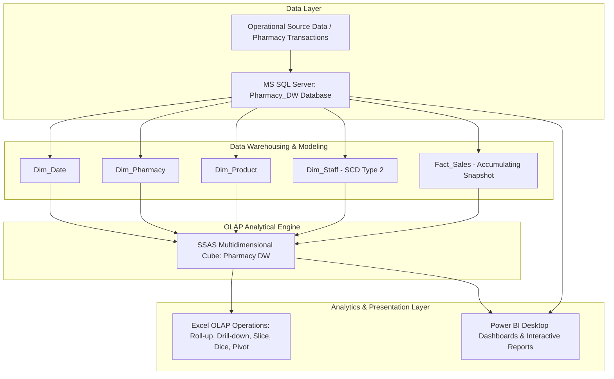

# 💊 PharmaPulse Analytics: Enterprise Pharmacy Data Warehouse & Business Intelligence System

[](https://www.microsoft.com)
[](https://www.microsoft.com/sql-server)
[](https://learn.microsoft.com/en-us/analysis-services/multidimensional-models)
[](https://powerbi.microsoft.com)
[-orange.svg)](https://www.sliit.lk)

---

## 📌 Executive Summary

**PharmaPulse Analytics** is an end-to-end Data Warehousing and Business Intelligence (DWBI) solution developed for pharmaceutical retail chain operations. The project models transactional pharmacy data (prescriptions, retail sales, branch distributions, and pharmacist/staff tracking) into an optimized **Dimensional Star Schema**, implements a high-performance **SSAS Multidimensional Cube (MOLAP)**, provides **OLAP Analysis in Microsoft Excel**, and delivers executive **Business Intelligence Dashboards in Power BI**.

---

## 👨‍💻 Author & Academic Context

* **Student Name:** Abilas M A S
* **Student ID:** IT23720756
* **Institution:** Sri Lanka Institute of Information Technology (SLIIT)
* **Academic Year & Semester:** Year 3 Semester 1 (Y3S1)
* **Module:** Data Warehousing & Business Intelligence (IT3021) — Assignment 2

---

## 🏗️ System Architecture & Workflow

The architecture transitions operational source data through a multi-tier analytical pipeline:



---

## 📐 Dimensional Data Model (Star Schema)

The warehouse is designed around an **Accumulating Snapshot Fact Table** with associated conforming dimensions to track sales velocity, financial totals, and transaction processing durations.

```
                         ┌─────────────────────────┐
                         │       Dim_Date          │
                         ├─────────────────────────┤
                         │ PK  DateKey             │
                         │     FullDate            │
                         │     Day                 │
                         │     Month               │
                         │     Quarter             │
                         │     Year                │
                         │     DayOfWeek           │
                         └────────────┬────────────┘
                                      │ 1
                                      │
                                      │ *
┌─────────────────────────┐      ┌────┴─────────────────────────────┐      ┌─────────────────────────┐
│      Dim_Pharmacy       │      │           Fact_Sales             │      │       Dim_Product       │
├─────────────────────────┤      ├──────────────────────────────────┤      ├─────────────────────────┤
│ PK  PharmacyKey         │1    *│ PK  SalesKey                     │*    1│ PK  ProductKey          │
│     PharmacyID          ├──────┤ FK  ProductKey                   ├──────┤     ProductID           │
│     BranchName          │      │ FK  PharmacyKey                  │      │     ProductName         │
│     City                │      │ FK  StaffKey                     │      │     Category            │
│     Region              │      │ FK  DateKey                      │      │     Subcategory         │
└─────────────────────────┘      │     InvoiceID (Degenerate Dim)   │      │     Manufacturer        │
                                 │     QuantityPack                 │      └─────────────────────────┘
                                 │     UnitPrice                    │
                                 │     TotalAmount                  │
                                 │     AccmTxnCreateTime            │
                                 │     AccmTxnCompleteTime          │
                                 │     TxnProcessTimeHours          │
                                 └────┬─────────────────────────────┘
                                      │ *
                                      │
                                      │ 1
                         ┌────────────┴────────────┐
                         │       Dim_Staff         │
                         ├─────────────────────────┤
                         │ PK  StaffKey            │
                         │     StaffID             │
                         │     StaffName           │
                         │     Role                │
                         │     StartDate           │
                         │     EndDate             │
                         │     IsCurrent (SCD 2)   │
                         └─────────────────────────┘
```

### Table Breakdown

| Table Name | Type | Key Purpose & Attributes |
| :--- | :--- | :--- |
| **`Fact_Sales`** | Accumulating Snapshot Fact Table | Central transaction store with measures: `QuantityPack`, `UnitPrice`, `TotalAmount`, `TxnProcessTimeHours`, `AccmTxnCreateTime`, `AccmTxnCompleteTime`. Includes `InvoiceID` as a degenerate dimension. |
| **`Dim_Product`** | Conformed Dimension | Contains product hierarchy: `ProductID`, `ProductName`, `Category`, `Subcategory`, and `Manufacturer`. |
| **`Dim_Pharmacy`** | Conformed Dimension | Branch location details: `PharmacyID`, `BranchName`, `City`, and `Region`. |
| **`Dim_Staff`** | SCD Type 2 Dimension | Staff and pharmacist career/role tracking: `StaffID`, `StaffName`, `Role`, `StartDate`, `EndDate`, `IsCurrent` preserving historical accuracy. |
| **`Dim_Date`** | Conformed Dimension | Date intelligence with calendar hierarchy: `FullDate`, `Day`, `Month`, `Quarter`, `Year`, `DayOfWeek`. |

---

## 🗂️ Project Directory Structure

```plaintext
DWBI_Assignment_2_Answer_IT23720756/
├── 📁 CubeProject_IT23720756/         # SSAS Multidimensional OLAP Project
│   ├── CubeProject_IT23720756.dwproj  # Visual Studio SSAS Project file
│   ├── CubeProject_IT23720756.slnx    # Solution XML metadata
│   ├── Pharmacy DW.ds                 # Data Source configuration
│   ├── Pharmacy DW.dsv                # Data Source View (Tables & Relations)
│   ├── Pharmacy DW.cube               # SSAS Cube (Measures, Dimensions, MOLAP)
│   ├── Dim Date.dim                   # Date dimension definition & hierarchy
│   ├── Dim Pharmacy.dim               # Pharmacy branch dimension definition
│   ├── Dim Product.dim                # Product dimension definition
│   ├── Dim Staff.dim                  # Staff SCD Type 2 dimension definition
│   └── Fact Sales.dim                 # Fact Sales dimension mappings
│
├── 📁 DataWarehouse_IT23720756/       # Relational DW Backups & Database
│   └── Pharmacy_DW_Backup.bak         # Full MS SQL Server database backup
│
├── 📁 Excel_IT23720756/               # OLAP Analysis & Pivot Reporting
│   └── Pharmacy.xlsx                  # Live/Extracted OLAP operations workbook
│
├── 📁 PowerBIReports_IT23720756/      # Power BI Business Intelligence Reports
│   └── PowerBI_IT23720756.pbix        # Interactive Power BI report file
│
├── 📁 Document_IT23720756/            # Technical Documentation & Assignment Report
│   └── DWBI Assigment 2 .pdf          # Comprehensive project report & walkthrough
│
└── 📄 README.md                       # Project documentation & execution guide
```

---

## ⚡ SSAS Multidimensional Cube Implementation

* **Data Source & DSV:** Configured against the `Pharmacy_DW` database in SQL Server.
* **Storage Mode:** **MOLAP (Multidimensional Online Analytical Processing)** for maximum query aggregation speed.
* **Measures:**
  * `Total Amount` (Sum)
  * `Unit Price` (Sum / Average)
  * `Quantity Pack` (Sum)
  * `Txn Process Time Hours` (Sum / Processing Duration)
* **Dimension Usage & Relationships:** Foreign key bindings between `Fact_Sales` and `Dim_Product`, `Dim_Pharmacy`, `Dim_Staff`, and `Dim_Date`.

---

## 📊 OLAP Operations (Excel Analysis)

Demonstrated on `Pharmacy.xlsx` connected to the multidimensional data:

1. **Roll-Up (Aggregation):**
   * Summarized sales figures by collapsing lower granularity month-level data up to Quarter and Annual levels (`Year 2024` / `Quarter`).
2. **Drill-Down (De-aggregation):**
   * Expanded Year 2024 to inspect Quarter and granular monthly revenue trends.
3. **Slice (1D Filtering):**
   * Filtered sales performance for a single branch location via the `Pharmacy Key` slicer.
4. **Dice (Multi-dimensional Sub-cube):**
   * Applied multiple simultaneous slicers (`Pharmacy Key` $\times$ `Product Key`) to analyze specific product sales in select pharmacy branches.
5. **Pivot (Rotation of Axes):**
   * Rotated dimension axes by moving `Year` and `Quarter` from Row labels to Column labels for cross-tabulated matrix analysis.

---

## 📈 Power BI Visual Analytics & Reports

The `PowerBI_IT23720756.pbix` workbook features enterprise visualizations:

* **Report 1: Hierarchical Matrix Grid**
  * Matrix visualization with `Branch Name` in Rows, `Year & Quarter` hierarchy in Columns, and `Total Amount` in Values, providing instant subtotals and cross-branch comparisons.
* **Report 2: Multi-Criteria Filter Slicers**
  * Dynamic filtering using cascading Slicers for `City` and `Branch Name` to isolate regional performance.
* **Report 3: Sales Trend Clustered Column Chart**
  * Temporal trend visualization with `Date Hierarchy` on the X-axis and `Total Amount` on the Y-axis.
* **Report 4: Branch Deep-Dive Drill-Through Page**
  * Context-aware destination page with `Branch Name` filter to enable drill-through investigations into granular store transactions.

---

## 🚀 Setup & Execution Guide

### Prerequisites
* **Database:** Microsoft SQL Server 2019 / 2022
* **OLAP Engine:** SQL Server Analysis Services (SSAS) Multidimensional Mode
* **IDE:** Visual Studio 2019 / 2022 with *SQL Server Data Tools (SSDT)* and *Analysis Services Extension*
* **Analytics / BI:** Microsoft Excel 2016+ and Power BI Desktop

---

### Step 1: Restore the SQL Server Data Warehouse
1. Open **SQL Server Management Studio (SSMS)** and connect to your SQL Server instance.
2. Right-click **Databases** $\rightarrow$ **Restore Database...**.
3. Select **Device** $\rightarrow$ Click `...` $\rightarrow$ Add `DataWarehouse_IT23720756/Pharmacy_DW_Backup.bak`.
4. Restore the database as `Pharmacy_DW`.
5. Verify that tables `Dim_Date`, `Dim_Pharmacy`, `Dim_Product`, `Dim_Staff`, and `Fact_Sales` are loaded.

---

### Step 2: Open and Deploy the SSAS Cube
1. Open Visual Studio with SSDT installed.
2. Open `CubeProject_IT23720756/CubeProject_IT23720756.dwproj`.
3. In Solution Explorer, open `Pharmacy DW.ds` and update the Connection String / Server Name to match your local SQL Server instance.
4. Open `Pharmacy DW.cube` $\rightarrow$ Click **Browser** tab or right-click project $\rightarrow$ **Process / Deploy** to your local SSAS Multidimensional instance (`localhost` or `localhost\SSAS`).

---

### Step 3: Explore OLAP Operations in Excel
1. Open `Excel_IT23720756/Pharmacy.xlsx`.
2. Review sheets:
   * `Pivot` — Matrix cross-tabulation.
   * `Slice` — Single-dimension slicing.
   * `Dice` — Multi-dimension dicing.
   * `Roll-up` — Collapsed hierarchical totals.

---

### Step 4: Interact with Power BI Dashboards
1. Open `PowerBIReports_IT23720756/PowerBI_IT23720756.pbix` in **Power BI Desktop**.
2. If prompted for data source credentials, click **Transform Data** $\rightarrow$ **Data Source Settings** $\rightarrow$ update to point to your local SQL Server / SSAS database.
3. Explore the interactive Matrix visual, Slicers, Trend Charts, and Branch Drill-Through capabilities.

---

## 🛠️ Technology Stack

* **Database Engine:** Microsoft SQL Server (Transact-SQL)
* **OLAP Server:** Microsoft SQL Server Analysis Services (SSAS - Multidimensional)
* **BI & Data Visualization:** Microsoft Power BI Desktop
* **Spreadsheet Analytics:** Microsoft Excel (OLAP PivotTables & Slicers)
* **Development Environment:** Visual Studio (SSDT - SQL Server Data Tools)
* **Modeling Concepts:** Star Schema, Slowly Changing Dimensions (SCD Type 2), Accumulating Snapshot Fact Table, MOLAP Cubes

---

## 📜 License & Acknowledgments

This project was created for academic evaluation as part of the **IT3021 Data Warehousing and Business Intelligence** course at the **Sri Lanka Institute of Information Technology (SLIIT)**.
